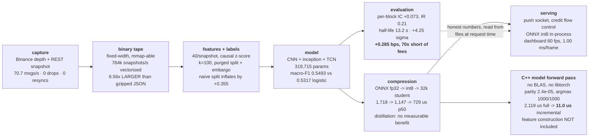

# tick-to-signal

**A live order-book microstructure system, end to end: exchange capture → custom
binary tape → a from-scratch deep LOB model → cost-aware evaluation →
compression → a hand-written C++ model forward pass at 11 µs p50 → FastAPI
serving and a 60 fps dashboard.** The signal is real, measured, and too small to
pay exchange fees — and the dashboard says so on its own front page.


*23 s loop, recorded from the running container by
[`scripts/record_demo.sh`](scripts/record_demo.sh) — the boot sequence,
liquidity building and evaporating on the depth tape, the model's signal ribbon
on the centreline, a real feed discontinuity rendered as a gap, and the latency
histogram settling. Higher quality:
[docs/assets/demo.mp4](docs/assets/demo.mp4). It is a 16 fps screencast of a UI
that renders at 60.*

```bash
docker compose up          # then open http://localhost:8000
```

No API keys, no network, no exchange account: the demo replays three committed
capture sessions from 2026-07-27 and produces the same output every time.

---

## Results

Every number below was produced by a script and read out of a committed record.
Nothing is typed by hand; where a figure has not been measured, it says so.

### The signal

| Metric | Result | Comparison | Source |
|---|---|---|---|
| **Macro-F1, teacher** (CNN+TCN, 319,715 params, held-out block) | **0.5493** | majority class 0.1657 · queue-imbalance rule 0.3950 | [train_ours](benchmarks/train_ours_btcusdt_20260728T102758Z.json) · [baselines](benchmarks/baselines_20260728T102430Z.json) |
| **Macro-F1, logistic regression on one snapshot** (123 params) | **0.5317** | the number that puts the deep model in perspective: **+0.018** for 2,600× the parameters | [baselines](benchmarks/baselines_20260728T102430Z.json) · [nb 04](notebooks/04_model_training.ipynb) |
| **Macro-F1, distilled student** (32,155 params, the shipped artefact) | **0.5723 (shipped seed)**; 3-seed distilled mean **0.5058 ± 0.0681**, scratch-trained control **0.5233 ± 0.0085** — **distillation shows no measurable benefit** | the shipped seed is the top of a wide distribution, not a typical draw | [distillation, 3 seeds](benchmarks/distillation_20260728T211009Z.json) · [nb 06](notebooks/06_compression_and_distillation.ipynb) |
| **Macro-F1 on FI-2010** (h=10, same architecture) | **0.751** | published on the same split: CNN-I 0.552 · LSTM 0.663 · B(TABL) 0.692 · C(TABL) 0.776 · DeepLOB 0.834 | [train_fi2010](benchmarks/train_fi2010_20260728T111135Z.json) |
| **Information coefficient** (Spearman, held-out) | per-block mean **+0.073**, std **0.351**, IR **0.21**, positive in **12 of 18** blocks | pooled **+0.421** — inflated by slow common drift across the whole block, **not tradeable** | [evaluation](benchmarks/evaluation_20260728T202537Z.json) · [nb 05](notebooks/05_honest_evaluation.ipynb) |
| **Permutation test** (200 block-shuffled draws) | **+4.25 σ**, exceeded 0 times in 200 (**p < 0.005**) | null mean −0.035, std 0.107 | [evaluation](benchmarks/evaluation_20260728T202537Z.json) · [IC blocks chart](benchmarks/evaluation_20260728T202537Z_ic_blocks.png) |
| **Signal decay** | IC peaks at **5 s** (0.444); **half-life 13.2 s** fitted from the peak, R² **0.98** | the IC *rises* to the 2.7 s label horizon before it decays | [decay chart](benchmarks/evaluation_20260728T202537Z_decay.png) |
| **Label balance** (k=100, α=9e-6) | down 0.345 / flat 0.334 / up 0.321 | chosen from a 20-cell grid on our own capture, not inherited | [nb 03](notebooks/03_dataset_and_labels.ipynb) |
| **Leakage inflation from a naive random split** | **+0.355 accuracy on data containing no signal at all** (0.960 vs 0.605) | measured with a memorising 1-NN on a random walk | [nb 03](notebooks/03_dataset_and_labels.ipynb) · [stage 3 notes](docs/INTERVIEW_NOTES_stage3.md) |

### The economics — the result that decides the project

| Metric | Result | Source |
|---|---|---|
| **Gross edge per trade** (touch prices, pre-fee) | **+0.285 bps** over 2,788 trades | [evaluation](benchmarks/evaluation_20260728T202537Z.json) |
| **Breakeven taker fee** | **0.142 bps per side** — half the gross, because a round trip pays it twice | [PnL chart](benchmarks/evaluation_20260728T202537Z_pnl.png) |
| **Cheapest published Binance taker tier** (VIP 9) | 4.0 bps = **28× breakeven** | [stage 5 notes](docs/INTERVIEW_NOTES_stage5.md) |
| **The tier a new account actually gets** (VIP 0) | 10.0 bps = **70× breakeven** | [stage 5 notes](docs/INTERVIEW_NOTES_stage5.md) |
| **Median spread** | **0.0015 bps** — one 0.01 USDT tick on a ~65,000 USDT mid | [evaluation](benchmarks/evaluation_20260728T202537Z.json) |

**Every published tier is unaffordable, and a test fails if that ever stops being
true.** Stage 5's verdict, served verbatim by the API and rendered on the
dashboard: *a real but small and unstable directional edge with a multi-second
half-life, roughly two orders of magnitude too small to pay Binance's taker fee,
therefore not tradeable as a taker by anyone at any published tier.*

### The systems work

| Metric | Result | Comparison | Source |
|---|---|---|---|
| **Capture** | **70.7 msgs/s** mean over 283 s, **0 drops, 0 resyncs** | this is the rate Binance sent, not our ceiling — the ceiling is unmeasured | [stage 1 report](benchmarks/stage1_capture_20260727.md) |
| **Book correctness vs exchange** (top 10 levels) | 2 PASS / 2 SKEW / 0 FAIL over 283 s; both exact-update-id comparisons matched perfectly | — | [stage 1 report](benchmarks/stage1_capture_20260727.md) |
| **Storage vs raw JSON** | **1.57× smaller** (43.5 vs 68.3 bytes/event) | — | [binfmt](benchmarks/binfmt_20260727T162516Z.json) |
| **Storage vs *gzipped* JSON** | **6.56× LARGER** — the format loses on size, and that is the honest headline | gzip costs one line and is available to both | [binfmt](benchmarks/binfmt_20260727T162516Z.json) · [nb 02](notebooks/02_binary_format_design.ipynb) |
| **Sequential read** | **2.01 M records/s — 4.86× faster** than gzipped JSON | 410 k records/s | [binfmt](benchmarks/binfmt_20260727T162516Z.json) |
| **Vectorised read** (mmap, zero-copy) | **784 k snapshots/s — 261× faster** than full JSON replay | 2.7 k snapshots/s | [binfmt](benchmarks/binfmt_20260727T162516Z.json) |
| **C++/PyTorch parity** (mandatory test) | **max abs diff 2.4e-05**, argmax **1000/1000**, green on all four builds | tolerance 1e-4, 1,000 real held-out windows | [inference_cpp](inference_cpp/) · [stage 7a notes](docs/INTERVIEW_NOTES_stage7a.md) |
| **Incremental vs full recompute** (mandatory test) | **bit-identical**, 333/333 comparisons | equality, not a tolerance | [incremental_test.cpp](inference_cpp/tests/incremental_test.cpp) |
| **Dashboard render** | **60.0 fps**, p50 **1.00 ms** / max 5.60 ms per frame, 0 frames over 12 ms in 60 s | budget 4 ms, enforced by an on-screen meter | [stage 8b notes](docs/INTERVIEW_NOTES_stage8b.md) · [method §8](docs/benchmark_methodology.md) |

### The latency frontier

| Variant | p50 | p99 | p99.9 | Macro-F1 | Harness |
|---|---|---|---|---|---|
| PyTorch eager fp32 | 11,186 µs | 17,785 µs | 21,820 µs | 0.5493 | Python |
| ONNX Runtime fp32 | 1,718 µs | 5,831 µs | 6,704 µs | 0.5493 | Python |
| ONNX Runtime int8 | 1,147 µs | 2,897 µs | 6,208 µs | 0.5469 | Python |
| distilled student fp32 | 297 µs | 1,482 µs | 4,546 µs | 0.5954 | Python |
| **distilled student int8 — what the server runs** | **729 µs** | 2,233 µs | 5,530 µs | 0.5723 | Python |
| C++ full recompute | 2,119 µs | 2,767 µs | 3,396 µs | 0.5954 *(inherited)* | C++ |
| **C++ incremental — the shipped fast path** | **11.0 µs** | 16.6 µs | 86.9 µs | 0.5954 *(inherited)* | C++ |

Sources: [python_variants](benchmarks/python_variants_20260801T082226Z.json) ·
[cpp_full_p4](benchmarks/cpp_full_p4_stream.json) ·
[cpp_incremental_p4](benchmarks/cpp_incremental_p4_stream.json) ·
[nb 07](notebooks/07_latency_results_analysis.ipynb)

> **What is inside these numbers — stated once, applying to every row.**
>
> The measured path is the **model forward pass only**: a prepared `[40]`
> feature column in, three logits out. **Feature construction is excluded**, and
> it is not small — measured inside the serving process at p50 ~1,400–2,500 µs
> against ~500–900 µs of ONNX inference. Its C++ cost is `TODO(measure)` and is
> the one genuine open item in this repository (see [Known gaps](#known-gaps)).
>
> The two harnesses are **different instruments measuring different programs**:
> Python rows use `perf_counter_ns` around `session.run`; C++ rows use
> QueryPerformanceCounter around a hand-written pass, pinned to one core, over
> 10⁵–10⁶ iterations after settling. They are not a continuum, and the dashboard
> draws them with different marks for that reason.
>
> The two C++ rows **inherit** the fp32 student's accuracy, because the C++ path
> is a parity-checked float32 re-implementation of it and **no C++ program in
> this repository has ever scored a test block**. Inherited is not measured, and
> the API labels it as such.

---

## What this is, and what it is not

**It is** a complete, measured microstructure pipeline that a stranger can run
in one command, and a characterisation of a weak signal honest enough to be
useful: what its information coefficient is, how unstable that is block to
block, how fast it decays, and exactly how far short of trading costs it falls.

**It is not a profitable strategy, and it does not claim to be.** The gross edge
is +0.285 bps per trade; the cheapest published taker fee on Binance is 28×
that, and the tier a new account gets is 70×. After fees this loses money at
every published tier. That result is in the body of this README, on the largest
panel of the dashboard, and in the API response — not in a footnote.

**Latency is not what rescues this signal.** The measured IC half-life is 13.2
seconds. A signal with a 13-second half-life does not care whether the decision
took 11 microseconds or 11 milliseconds — the market has not moved meaningfully
in either window. The microsecond path is **the prerequisite for a different
class of signal**, one with a sub-second half-life, and for a maker deciding
whether to pull a quote before it is picked off. The engineering is real; the
claim it supports is narrow, and that narrow claim is the one made here.

**What it is good evidence of:** that the author can build a correct book from a
live exchange feed, design a storage format and then report that it lost on its
headline axis, avoid the leakage that makes microstructure ML look easy,
evaluate a signal against costs rather than against accuracy, hand-write and
parity-test a model forward pass in C++, and build an instrument that refuses to
flatter the result it displays.

---

## Architecture



The dotted edge is load-bearing. The dashboard's evaluation panels read
`benchmarks/*.json` at request time through
[`serving/records.py`](serving/records.py), so the UI cannot drift from the
measurements, and every payload names the file it came from.

---

## Predictions I got wrong

Collectively this is the most credible section in the repository. Each item was
a belief held confidently enough to write down, then contradicted by a
measurement.

**1. The binary format would compress 10–20×. It is 6.56× LARGER than gzipped
JSON.** It beats *raw* JSON by 1.57×, which is the flattering comparison and the
wrong one — gzip costs one line and is available to both. Diagnosed to per-level
timestamps and the padding of a fixed-width record; the fix is specified and
unimplemented. The format's real win is random access: 261× faster vectorised
reads. ([nb 02](notebooks/02_binary_format_design.ipynb) ·
[stage 2 notes](docs/INTERVIEW_NOTES_stage2.md))

**2. A shifted-label control returned +0.297 and looked exactly like leakage.**
The honest first reading was that the pipeline was broken. A shift sweep showed
the IC decaying smoothly with shift distance rather than holding flat — the
signature of a real slow signal, not of leakage — and a 200-draw permutation
test settled it at +4.25 σ. ([stage 5 notes](docs/INTERVIEW_NOTES_stage5.md))

**3. A single block-shuffle draw was presented as a control.** It came back at
about −1 σ, which is a coin flip dressed as evidence: one draw says nothing
about a distribution. Replaced with 200 draws and a z-score.
([evaluation](benchmarks/evaluation_20260728T202537Z.json))

**4. The spread was recorded as ~0.15 bps in Stage 1. It is 0.0015 bps — wrong
by 100×.** Caught only because Stage 5's entire conclusion turns on the ratio of
edge to cost, so the number was re-derived from tick size and mid instead of
being quoted. A conclusion that depends on a number is the best possible reason
to recompute it.

**5. The CPU affinity pin was silently refused.** A ctypes call truncated the
mask argument, `SetProcessAffinityMask` failed, and the code carried on beneath
a comment asserting the process was pinned. Every latency number in that run
would have been published as pinned when it was not.
([stage 6 notes](docs/INTERVIEW_NOTES_stage6.md))

**6. Accuracy scored on a 4,000-sample prefix reversed the model ranking.** A
"quick" evaluation on the first slice of a time-ordered test block ranked the
variants wrongly; the same trap then reversed the calibration conclusion a stage
later. A prefix of a time-ordered test set is not a sample of it.
([calibration](benchmarks/calibration_20260731T180908Z.json) ·
[nb 06](notebooks/06_compression_and_distillation.ipynb))

**7. Distillation was expected to help. It measured negative.** Distilled
students averaged **0.5058 ± 0.0681** macro-F1 across three seeds against
**0.5233 ± 0.0085** for identical students trained from scratch. The shipped
artefact is a 0.5723 seed — the top of a wide distribution — and quoting that
number alone would be selecting on the outcome, so it is always reported with
its control. ([distillation](benchmarks/distillation_20260728T211009Z.json))

**8. `std::chrono::steady_clock` advertised 1 ns resolution and delivered
~1 ms.** 19,518 of 20,000 forward passes were recorded as taking exactly zero
time, and the resulting "p50 5,000 µs" was a 1 ms grid rather than a
measurement. Every harness now measures its clock before trusting it and
refuses to publish percentiles it cannot resolve.
([stage 7b notes](docs/INTERVIEW_NOTES_stage7b.md))

**9. CPU clock varied 3.24× under thermal load,** turning a genuine 34%
improvement into an apparent 52% regression. The same binary in two machine
states is committed as
[cpp_incremental_p3_stream](benchmarks/cpp_incremental_p3_stream.json) and
[cpp_incremental_p3_throttled](benchmarks/cpp_incremental_p3_throttled.json).
Benchmarks now settle first, calibrate before and after, and record both.

**10. The first correct hand-written C++ was 6.5× SLOWER than ONNX Runtime**
(5,597 µs vs 856 µs p50 on the same model), because ONNX Runtime ships
vectorised kernels a naive nested loop does not match. The eventual 193× came
from an **algorithm** the runtime could not express — advance one tick instead
of recomputing a 100-row window — and about 2× from layout and loop shape. **The
language was the vehicle, not the reason.**
([cpp_full_p0](benchmarks/cpp_full_p0_stream.json) ·
[nb 07](notebooks/07_latency_results_analysis.ipynb))

**11. The one-frame mailbox was believed to bound what the client sees. It did
not.** `send_text()` returns on hand-off to the transport, so ~208 stale frames
accumulated in uvicorn's write buffer and were delivered *in order*, minutes
behind the market — while the unit test passed. Fixed with credit-based flow
control. Then building the dashboard found the same mailbox silently destroying
**every session boundary**: 1,126 frames and 0 boundaries delivered in 30
seconds, because a boundary is an event, not state.
([stage 8a notes](docs/INTERVIEW_NOTES_stage8a.md) ·
[stage 8b notes](docs/INTERVIEW_NOTES_stage8b.md))

---

## Known gaps

Stated here rather than left to be discovered.

- **C++ feature construction is `TODO(measure)`.** The 11 µs figure covers the
  model forward pass from a prepared feature column. Feature construction is
  still Python and its C++ cost has never been measured. It is O(40) work
  against ~46,000 multiply-accumulates, so it *should* be small — but "should be
  small" is not a measurement and is not reported as one.
- **The capture throughput ceiling is unmeasured.** 70.7 msgs/s is what the
  exchange sent, not what the capture path can absorb.
- **End-to-end serving latency under load is unmeasured.** The harness measures
  service time in a closed loop; an open-loop harness with a fixed arrival
  schedule is a different program. See
  [benchmark_methodology.md §3](docs/benchmark_methodology.md) on coordinated
  omission.
- **Live mode is structurally complete but unexercised.** `TTS_MODE=live` and
  the `capture` compose profile have never been run against a live exchange.
- **One venue, one symbol, one day.** Three capture sessions of BTCUSDT on
  2026-07-27. Nothing here establishes that any of it generalises.

---

## Quickstart

```bash
docker compose up                 # demo dashboard at http://localhost:8000
docker compose --profile live up  # optional: live capture + live serving
```

The API is useful on its own — every number the dashboard draws is available as
JSON, and each payload names the file it came from:

```bash
curl localhost:8000/stability    # per-block ICs; the pooled figure is deliberately
                                 #   named `pooled_ic_not_tradeable`
curl localhost:8000/economics    # breakeven fee, every tier, Stage 5's verdict
curl localhost:8000/pareto       # the frontier, each row tagged with its harness
curl localhost:8000/latency      # rolling serving percentiles + what they exclude
```

Development, tests and notebooks:

```bash
pip install -r requirements.txt
./run_checks.sh                   # pytest + C++ ctest + every notebook top-to-bottom
scripts/record_demo.sh            # re-record the demo GIF, mp4 and stills
```

---

## Repository map

| Path | What lives there |
|---|---|
| [data_engine/](data_engine/) | Exchange capture, book reconstruction, binary tape format, replay |
| [ml/](ml/) | Features, labels, purged splits, model, training, evaluation, export |
| [inference_cpp/](inference_cpp/) | Hand-written C++ forward pass, parity and equivalence tests, bench harness |
| [serving/](serving/) | FastAPI service and [serving/dashboard/](serving/dashboard/) — ES modules, no build step |
| [notebooks/](notebooks/) | Every piece of research, narrated, runnable top-to-bottom |
| [tests/](tests/) | Book invariants, format round-trips, leakage checks, C++ parity, dashboard guards |
| [benchmarks/](benchmarks/) | Benchmark scripts and their timestamped, committed results |
| [docs/](docs/) | Per-stage interview notes, benchmark methodology, demo assets |
| [scripts/](scripts/) | Demo recording |

## Depth

- **[docs/INTERVIEW_NOTES_master.md](docs/INTERVIEW_NOTES_master.md)** — the
  60-second pitch, a five-minute walkthrough of the dashboard, and the 25
  hardest questions with answers and `file:line` pointers.
- **[docs/benchmark_methodology.md](docs/benchmark_methodology.md)** — exactly
  how every latency number was measured: clock, pinning, warmup, iteration
  counts, thermal state, and what is deliberately not controlled.
- Per-stage notes, each with its design decisions, rejected alternatives and ten
  hardest questions:
  [1 capture](docs/INTERVIEW_NOTES_stage1.md) ·
  [2 storage](docs/INTERVIEW_NOTES_stage2.md) ·
  [3 data](docs/INTERVIEW_NOTES_stage3.md) ·
  [4 model](docs/INTERVIEW_NOTES_stage4.md) ·
  [5 evaluation](docs/INTERVIEW_NOTES_stage5.md) ·
  [6 compression](docs/INTERVIEW_NOTES_stage6.md) ·
  [7a C++ correctness](docs/INTERVIEW_NOTES_stage7a.md) ·
  [7b C++ speed](docs/INTERVIEW_NOTES_stage7b.md) ·
  [8a serving](docs/INTERVIEW_NOTES_stage8a.md) ·
  [8b dashboard](docs/INTERVIEW_NOTES_stage8b.md)

## How this repository is built

The working rules live in [CLAUDE.md](CLAUDE.md) and are enforced by
`run_checks.sh`: research is developed in notebooks and mirrored into modules;
every module has tests; benchmarks are scripts that write timestamped records;
**a number that has not been measured is marked `TODO(measure)` rather than
estimated**; and every stage ends with written interview notes including the
questions its own author would least like to be asked.

## Licence

[MIT](LICENSE).
